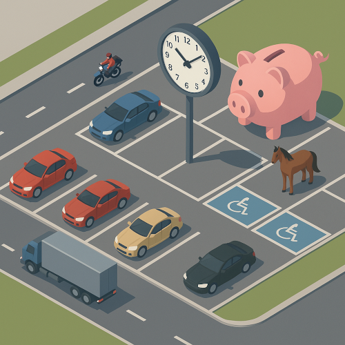

# Parking Manager

Parking Manager est un projet pédagogique. Il est pensé comme un skate-park pour programmeur/programmeuses afin de pouvoir découvrir, faire ou créer des TP (travaux pratiques) déstinés à illustrer la P.O.O (programmation orientée objets) et les grands design pattern de celle-ci 

L'univers proposé est celui d'un logiciel de gestion de parking avec des véhicules de différents types (voitures, motos, camions), différents type de place, différents types de tarifs etc... dans l'esprits des jeux vidéos de gestion type Theme Hospital™, Roller coaster tycoon ou autre.  

## Présentation

Bravo ! Votre équipe de développement a remporté l'appel d'offre 🎯
Un tout nouveau cahier des charges vous attend !

Notre parking doit accueillir plein de types d’usagé.e.s !
Certain.e.s veulent se garer longtemps, d’autres juste un petit moment.

Il faut aussi gérer l’argent récolté, le parking doit être inclusif : des places réservées aux personnes en situation de handicap, des tarifs préférentiels pour les abonné.e.s... 💸

Attention, de nouveaux usagé.e.s inattendu.e.s débarquent aussi : des chevaux (!), et même un énorme cochon tirelire vous observe depuis le centre du parking, juste à côté de la grande horloge fraîchement installée. 🐴🐖⏰

Bref, préparez-vous : de nouveaux défis vous attendent !

## Objectifs 

Votre objectif est de coder une version fonctionnelle. 
Vous êtes libres de structurer votre code comme vous voulez, 
mais attention : au fur et à mesure que le projet évoluera, 
de nouvelles contraintes et fonctionnalités seront ajoutées.

## Installation

1. Clonez le projet : 
`git clone https://github.com/vincentkollebolle/parkingManager.git`

2. Accédez au répertoire 

3. Commencez à coder !

## Notes d'organisation

Les branches de se repository sont utilisés pour les différents projets : - La branche main contient le starter-kit et les exercices.
- La branche fonctionnelle contient le code fonctionnelle (todo)
- La branche solution contient la solution des exercices (todo)

## Exercices 

Les exercices vous attendent ici : 
[Exercices](docs/index.md)

## Information & Contact

Vincent BONNIER
bonnier.vincentpro@gmail.com 

