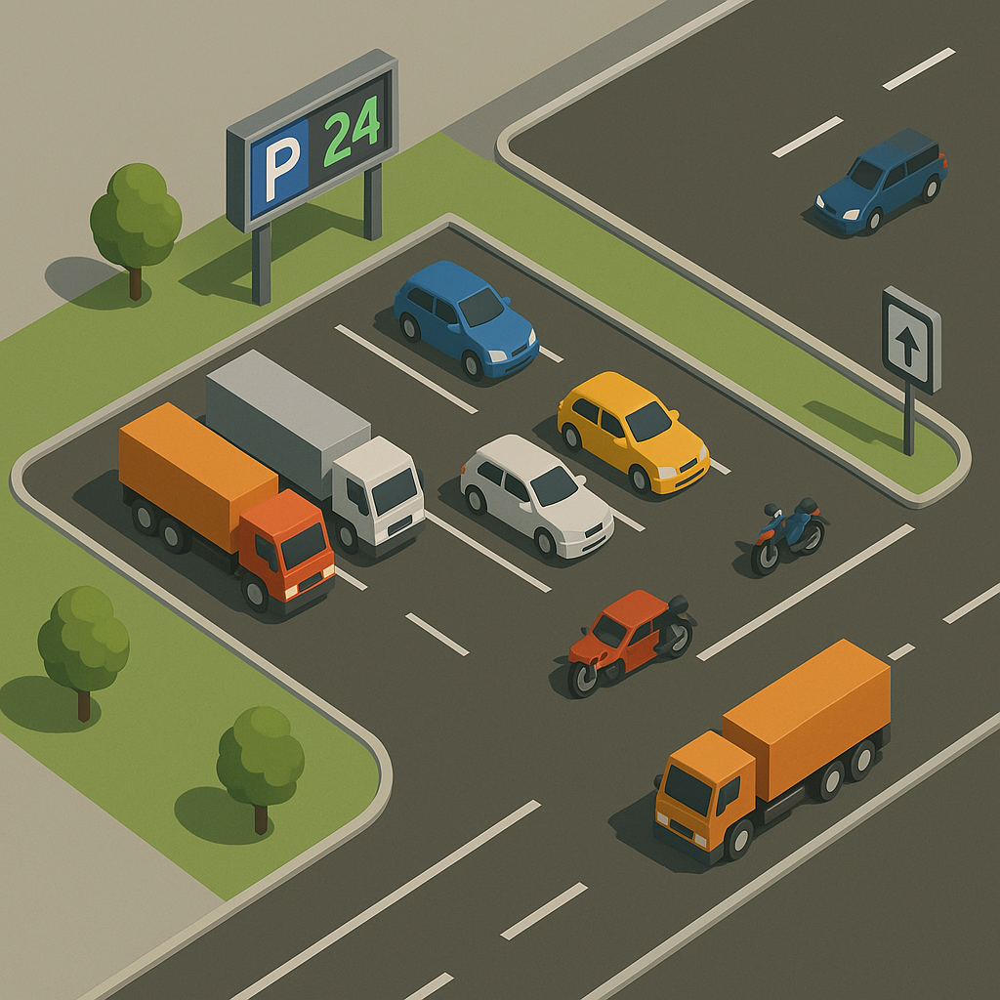

# Starter Kit 1

## Contexte

Votre équipe de développement a été missionnée pour concevoir 
un logiciel de gestion d’un parking moderne. 
Ce parking doit pouvoir accueillir différents types de véhicules et offrir 
plusieurs services aux clients.

Votre objectif est de coder une première version fonctionnelle. 
Vous êtes libres de structurer votre code comme vous voulez, 
mais attention : au fur et à mesure que le projet évoluera, 
de nouvelles contraintes et fonctionnalités seront ajoutées.

##  La route (Road)
La Route délègue au véhicule le fait d’interagir avec le parking

**Design pattern à implémenter** :
- 💡 Factory 

## Une classe Parking
- Le parking contient N places (paramétrable).
- Chaque place peut être libre ou occupée.
- Un véhicule ne peut se garer que si une place est libre.

**Design pattern à implémenter** :
💡 Singleton

## Une classe Vehicle
- Le parking accepte des voitures, des motos et des camions.
- Certains véhicules (ex. : camions) occupent plusieurs places.

**Design pattern à implémenter** :
- 💡 Car, Truck, Motorcycle extends Vehicle
- 💡 Factory Method
- 💡 Template Method
- 💡 Design pattern State

## Bonus : Architecture globale MVC
- 💡 L'architecture est pensée en MVC (+ Front Controller si besoin est).
